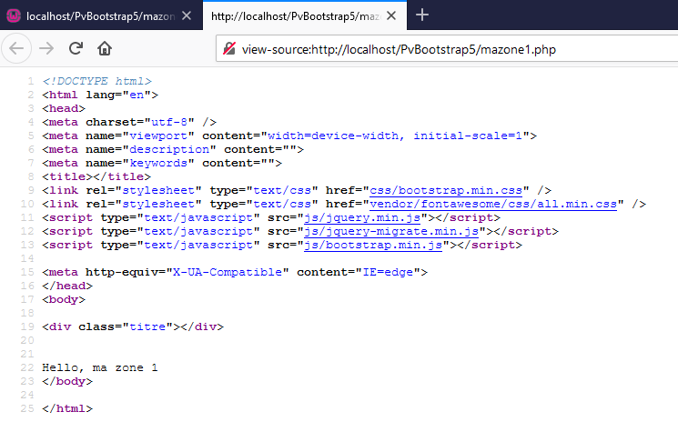
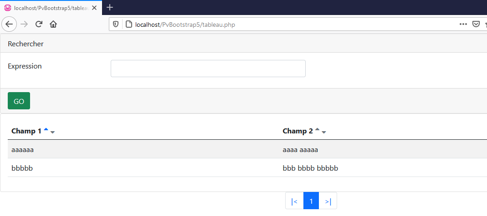

# Zone Bootstrap 5 - PHP-PV

## Pre-Requis

Librairie | Lien | Requis
------------ | ------------- | -------------
JQuery | https://www.jquery.com | Oui
Bootstrap5 | https://www.getbootstrap.com | Oui

## Installation

- Téléchargez le code source de PHP-PV sur GITHUB. Décompressez le fichier **php-pv-master.zip**. Copiez le contenu du dossier **php-pv-master** dans **/**
- Copiez le fichier **jquery-3.x.x.min.js** dans **/js/jquery.min.js**
- Copiez le fichier **jquery-migrate-1.x.x.min.js** dans **/js/jquery-migrate.min.js**
- Décompressez le fichier **bootstrap-5.x.x-dist.zip**. Copiez :
	- **bootstrap-5.x.x-dist/css/bootstrap.min.css** vers **/css/bootstrap.min.css**
	- **bootstrap-5.x.x-dist/js/bootstrap.bundle.min.js** vers **/js/bootstrap.min.js**
- Décompressez le fichier **fontawesome-free-5.x.x-web.zip**. Copiez le contenu du dossier **fontawesome-free-5.x.x-web/** dans **/vendor/fontawesome/**

Vous devez avoir la structure suivante :

```
/php-pv-master
/css
	bootstrap.min.css
/js
	bootstrap.min.js
	jquery-migrate.min.js
	jquery.min.js
/vendor
	fontawesome
```	

Créez votre fichier **/mazone1.php** avec ce contenu :

```php
<?php
// Librairie PHP-PV par defaut
include dirname(__FILE__)."/php-pv-master/Pv/Base.class.php" ;
// Librairie Bootstrap 5
include dirname(__FILE__)."/php-pv-master/Pv/IHM/Bootstrap5.class.php" ;
// Déclarer la classe Application
class MonApplication1 extends PvApplication
{
protected function ChargeIHMs()
{
// Inscrire la zone bootstrap dans l'application
$this->InsereIHM('mazone1', new MaZone1) ;
}
}
// Déclarer la zone Bootstrap
class MaZone1 extends PvZoneBaseBootstrap5
{
public $InclureFontAwesome = 1 ; // Inclure la librairie Font Awesome
public $AccepterTousChemins = 1 ;
protected function ChargeScripts()
{
// Inscrire le script index de la zone
$this->InsereScriptParDefaut(new MonScript1()) ;
}
}
// Déclarer le script index
class MonScript1 extends PvScriptWebSimple
{
public function RenduSpecifique()
{
return "Hello, ma zone 1" ;
}
}
// Afficher la zone dans le navigateur
$app = new MonApplication1() ;
$app->Execute() ;

?>
```

Résultat dans un navigateur :


Voici le code source de cette page dans le navigateur :



## Tableau de données

### Utilisation

La classe tableau de données est **PvTableauDonneesBootstrap5**.

```php
class MonScript1 extends PvScriptWebSimple
{
public function DetermineEnvironnement()
{
// Déclaration
$this->Tabl1 = new PvTableauDonneesBootstrap5() ;
// Chargement de la config
$this->Tabl1->AdopteScript("tabl1", $this) ;
$this->Tabl1->ChargeConfig() ;
$this->Tabl1->ToujoursAfficher = 1 ;
// Définition des filtres de sélection
$this->Flt1 = $this->Tabl1->InsereFltSelectHttpGet("expression", "champ1 like concat(<self>, '%')") ;
$this->Flt1->Libelle = "Expression" ;
// Définition des colonnes
$this->Tabl1->InsereDefColCachee("id") ;
$this->Tabl1->InsereDefCol("champ1", "Champ 1") ;
$this->Tabl1->InsereDefCol("champ2", "Champ 2") ;
// Définition du fournisseur de données
$this->Tabl1->FournisseurDonnees = new PvFournisseurDonneesSql() ;
$this->Tabl1->FournisseurDonnees->BaseDonnees = new MaBD1() ;
$this->Tabl1->FournisseurDonnees->RequeteSelection = "matable1" ;
}
public function RenduSpecifique()
{
$ctn = '' ;
$ctn .= $this->Tabl1->RenduDispositif() ;
return $ctn ;
}
}
```



### Propriétés / Méthodes spécifiques

Propriété | Description
------------- | -------------
$ClasseCSSRangee | Classe CSS tableau de la rangée. Par défaut "table-striped"
$ClsBstBoutonSoumettre | Classe CSS du bouton "Rechercher" pour filtrer les résultats. Par défaut "btn-success"
$ClsBstFormFiltresSelect | Classe CSS de la largeur du formulaire des filtres. Par défaut "col-12 col-sm-8 col-md-6"

```php
// Déclaration
$this->Tabl1 = new PvTableauDonneesBootstrap5() ;
// Propriétés spécifiques
$this->Tabl1->ClasseCSSRangee = "table-bordered" ;
$this->Tabl1->ClsBstBoutonSoumettre = "btn-info" ;
// ...
$this->Tabl1->AdopteScript("tabl1", $this) ;
```

## Grille de données

### Utilisation

La classe Grille de données est **PvGrilleDonneesBootstrap5**.

```php
class MonScript1 extends PvScriptWebSimple
{
public function DetermineEnvironnement()
{
// Déclaration
$this->Tabl1 = new PvGrilleDonneesBootstrap5() ;
// Chargement de la config
$this->Tabl1->AdopteScript("gril1", $this) ;
$this->Tabl1->ChargeConfig() ;
// Définition des filtres de sélection
$this->Flt1 = $this->Tabl1->InsereFltSelectHttpGet("expression", "champ1 like concat(<self>, '%')") ;
$this->Flt1->Libelle = "Expression" ;
// Définition des colonnes
$this->Tabl1->InsereDefColCachee("id") ;
$this->Tabl1->InsereDefCol("champ1", "Champ 1") ;
$this->Tabl1->InsereDefCol("champ2", "Champ 2") ;
$this->Tabl1->ContenuLigneModele = '<p>${champ1}</p>
<p>Champ 2 : ${champ2}</p>' ;
// Définition du fournisseur de données
$this->Tabl1->FournisseurDonnees = new PvFournisseurDonneesSql() ;
$this->Tabl1->FournisseurDonnees->BaseDonnees = new MaBD1() ;
$this->Tabl1->FournisseurDonnees->RequeteSelection = "matable1" ;
}
public function RenduSpecifique()
{
$ctn = '' ;
$ctn .= $this->Tabl1->RenduDispositif() ;
return $ctn ;
}
}
```

### Propriétés / Méthodes spécifiques

Propriété | Description
------------- | -------------
$ClasseCSSRangee | Classe CSS tableau de la rangée. Par défaut "table-striped"
$ClsBstBoutonSoumettre | Classe CSS du bouton "Rechercher" pour filtrer les résultats. Par défaut "btn-success"
$ClsBstFormFiltresSelect | Classe CSS de la largeur du formulaire des filtres. Par défaut "col-12 col-sm-8 col-md-6"

```php
// Déclaration
$this->Tabl1 = new PvGrilleDonneesBootstrap5() ;
// Propriétés spécifiques
$this->Tabl1->ClasseCSSRangee = "table-bordered" ;
$this->Tabl1->ClsBstBoutonSoumettre = "btn-info" ;
// ...
$this->Tabl1->AdopteScript("tabl1", $this) ;
```

## Formulaire de données

### Utilisation

La classe formulaire de données est **PvFormulaireDonneesBootstrap5**.

```php
class MonScript1 extends PvScriptWebSimple
{
public $Form1 ;
public $Flt1 ;
public $Flt2 ;
public function DetermineEnvironnement()
{
// Initiation
$this->Form1 = new PvFormulaireDonneesBootstrap5() ;
// Toujours afficher le formulaire
$this->Form1->InclureElementEnCours = 0 ;
$this->Form1->InclureTotalElements = 0 ;
// Définir la classe commande "Executer"
// $this->Form1->NomClasseCommandeExecuter = "MaCmdExecScript2" ;
// Liaison avec le script en cours
$this->Form1->AdopteScript("form1", $this) ;
// Chargement de la config
$this->Form1->ChargeConfig() ;
// Définition des autres propriétés
$this->Flt1 = $this->Form1->InsereFltEditHttpPost("champ1") ;
$this->Flt1->Libelle = "Champ 1" ;
$this->Flt2 = $this->Form1->InsereFltEditHttpPost("champ2") ;
$this->Flt2->Libelle = "Champ 2" ;
}
public function RenduSpecifique()
{
$ctn = '' ;
// Rendu du formulaire de donnees
$ctn .= $this->Form1->RenduDispositif() ;
return $ctn ;
}
}
```


### Propriétés / Méthodes spécifiques

Propriété | Description
------------- | -------------
$ClasseCSSSucces | Classe CSS Bootstrap du message succès de l'exécution d'une commande. Par défaut "alert alert-primary"
$ClasseCSSErreur | Classe CSS Bootstrap du message erreur de l'exécution d'une commande. Par défaut "alert alert-danger"
$ClasseCSSCommandeExecuter | Classe CSS Bootstrap du bouton "Exécuter". Par défaut "btn-primary"
$ClasseCSSCommandeAnnuler | Classe CSS Bootstrap du bouton "Annuler". Par défaut "btn-danger"

```php
// Initiation
$this->Form1 = new PvFormulaireDonneesBootstrap5() ;
// Toujours afficher le formulaire
$this->Form1->InclureElementEnCours = 0 ;
$this->Form1->InclureTotalElements = 0 ;
$this->Form1->ClasseCSSErreur = "btn-warning" ;
$this->Form1->ClasseCSSCommandeExecuter = "btn-info" ;
// ...
$this->Form1->AdopteScript("form1", $this) ;
```

## Dessinateur de filtres

### Utilisation

Le dessinateur de filtres fournit le rendu des filtres selection d'un tableau de données et filtres édition du formulaire de données.
Pour Bootstrap 5, utilisez la classe **PvDessinFiltresDonneesBootstrap5**.

```php
class DessinFiltres1 extends PvDessinFiltresDonneesBootstrap5
{
}

class MonScript1 extends PvScriptWebSimple
{
public function DetermineEnvironnement()
{
// Déclaration
$this->Tabl1 = new PvGrilleDonneesBootstrap5() ;
// Chargement de la config
$this->Tabl1->AdopteScript("gril1", $this) ;
$this->Tabl1->ChargeConfig() ;
$this->Tabl1->DessinateurFiltresSelection = new DessinFiltres1() ;
// ...
}
```

### Propriétés principales

Propriété | Description
------------- | -------------
$ColXs | Classe CSS Bootstrap Xs du bloc des filtres pour les petits écrans
$ColSm | Classe CSS Bootstrap Sm du bloc des filtres
$ColMd | Classe CSS Bootstrap Md du bloc des filtres
$ColLd | Classe CSS Bootstrap Ld du bloc des filtres
$UtiliserContainerFluid | Utiliser le container fluid
$EditeurSurligne | Mettre l'éditeur sur une autre ligne
$ColXsLibelle | Classe CSS Bootstrap Xs du libellé
$ClsBstLibelle | Classe CSS Bootstrap complémentaire du libellé
$AlignLibelle | Alignement html du libellé
$ColXsEditeur | Classe CSS Bootstrap complémentaire de l'éditeur
$AlignEditeur | Alignment html de l'éditeur

## Scripts Membership

Les scripts membership de la Zone ont été adaptés pour Bootstrap 5.

Nom du script | Classe script web | Pré-requis | Description
------------- | ------------- | ------------- | -------------
connexion | PvScriptConnexionBootstrap5 | Aucun | Page de connexion
deconnexion | PvScriptDeconnexionBootstrap5 | Aucun | Page de déconnexion
recouvreMP | PvScriptRecouvreMPBootstrap5 | Aucun | Page pour récupérer son mot de passe, à partir du login et du mot de passe
inscription | PvScriptInscriptionBootstrap5 | Mettre la propriété $AutoriserInscription à 1 | Page d'inscription d'un membre
modifPrefs | PvScriptModifPrefsBootstrap5 | Mettre la propriété $AutoriserModifPrefs à 1 | Page pour modifier les informations du membre (nom, prénom, …)
doitChangerMotPasse | PvScriptDoitChangerMotPasseBootstrap5 | Aucun | Page qui force le membre connecté à changer son mot de passe
changeMotPasse | PvScriptChangeMotPasseBootstrap5 | Aucun | Page pour modifier le mot de passe
ajoutMembre | PvScriptAjoutMembreMSBootstrap5 | Aucun | Ajouter un membre
importMembre | PvScriptImportMembreMSBootstrap5 | Aucun | Importe des membres à partir d'un fichier CSV
modifMembre | PvScriptModifMembreMSBootstrap5 | Aucun | Modifie un membre
supprMembre | PvScriptSupprMembreMSBootstrap5 | Aucun | Désactive le membre
listeMembres | PvScriptListeMembresMSBootstrap5 | Aucun | Liste les membres
ajoutProfil | PvScriptAjoutProfilMSBootstrap5 | Aucun | Ajoute un profil
modifProfil | PvScriptModifProfilMSBootstrap5 | Aucun | Modifie un profil
supprProfil | PvScriptSupprProfilMSBootstrap5 | Aucun | Désactive le profil
listeProfils | PvScriptListeProfilsMSBootstrap5 | Aucun | Liste les profils
ajoutRole | PvScriptAjoutRoleMSBootstrap5 | Aucun | Ajoute un rôle
modifRole | PvScriptModifRoleMSBootstrap5 | Aucun | Modifie un rôle
supprRole | PvScriptSupprRoleMSBootstrap5 | Aucun | Désactive un rôle
listeRoles | PvScriptListeRolesMSBootstrap5 | Aucun | Liste les rôles

### Composants web Membership

Plusieurs scripts de membership utilisent un tableau de données ou un formulaire de données spécifique.

Nom du script | Classe script web | Classe composant | Propriété composant
------------- | ------------- | ------------- | -------------
recouvreMP | PvScriptRecouvreMPWeb | PvFormulaireRecouvreMPBootstrap5 | $NomClasseFormulaireDonnees
inscription | PvScriptInscriptionWeb | PvFormulaireInscriptionMembreBootstrap5 | $NomClasseFormulaireDonnees
modifPrefs | PvScriptModifPrefsWeb | PvFormulaireModifInfosBootstrap5 | $NomClasseFormulaireDonnees
doitChangerMotPasse | PvScriptDoitChangerMotPasseWeb | PvFormulaireDoitChangerMotPasseBootstrap5 | $NomClasseFormulaireDonnees
changeMotPasse | PvScriptChangeMotPasseWeb | PvFormulaireChangeMotPasseBootstrap5 | $NomClasseFormulaireDonnees
ajoutMembre | PvScriptAjoutMembreBootstrap5 | PvFormulaireAjoutMembreBootstrap5 | $NomClasseFormulaireDonnees
modifMembre | PvScriptModifMembreBootstrap5 | PvFormulaireModifMembreBootstrap5 | $NomClasseFormulaireDonnees
supprMembre | PvScriptSupprMembreBootstrap5 | PvFormulaireSupprMembreBootstrap5 | $NomClasseFormulaireDonnees
listeMembres | PvScriptListeMembresBootstrap5 | PvTableauMembresBootstrap5Html | $NomClasseTableauDonnees
ajoutProfil | PvScriptAjoutProfilBootstrap5 | PvFormulaireAjoutProfilBootstrap5 | $NomClasseFormulaireDonnees
modifProfil | PvScriptModifProfilBootstrap5 | PvFormulaireModifProfilBootstrap5 | $NomClasseFormulaireDonnees
supprProfil | PvScriptSupprProfilBootstrap5 | PvFormulaireSupprProfilBootstrap5 | $NomClasseFormulaireDonnees
listeProfils | PvScriptListeProfilsBootstrap5 | PvTableauProfilsBootstrap5 | $NomClasseTableauDonnees
ajoutRole | PvScriptAjoutRoleBootstrap5 | PvFormulaireAjoutRoleBootstrap5 | $NomClasseFormulaireDonnees
modifRole | PvScriptModifRoleBootstrap5 | PvFormulaireModifRoleBootstrap5 | $NomClasseFormulaireDonnees
supprRole | PvScriptSupprRoleBootstrap5 | PvFormulaireSupprRoleBootstrap5 | $NomClasseFormulaireDonnees
listeRoles | PvScriptListeRolesBootstrap5 | PvTableauAjoutRoleBootstrap5 | $NomClasseTableauDonnees

```php
class MaZoneWeb1 extends PvZoneWebSimple
{
public $AutoriserModifPrefs = 1 ; 
public $NomClasseScriptConnexion = "MonScriptModifPrefs" ;
// ...
}
class FormModifPrefs1 extends PvFormulaireModifInfosBootstrap5
{
}
class MonScriptModifPrefs extends PvScriptModifPrefsWeb
{
public $NomClasseFormulaireDonnees = "FormModifPrefs1" ;
}
```
