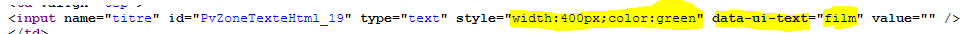
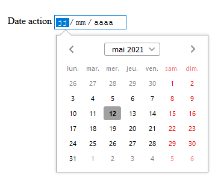
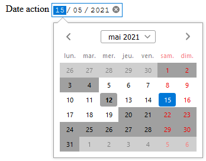
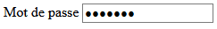
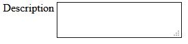

# Les composants de saisie pour formulaire

## PvZoneTexteHtml

### Présentation

C'est le composant par défaut pour un filre de données. Affiche une zone de texte standard.

```php
$filtre = $form->InsereFltEditHttpPost("titre", "titre") ;
$filtre->Libelle = "Titre" ;
$composant = $filtre->ObtientComposant() ; // Renvoie un objet PvZoneTexteHtml
```

Résultat :


### Propriétés/Méthodes spécifiques

Propriété | Description
------------- | -------------
$Largeur | Largeur de l'élément de formulaire
$Hauteur | Hauteur de l'élément de formulaire
$AttrsSupplHtml | Tableau pour contenir des attributs HTML complémentaires
$ClassesCSS | Tableau pour contenir d'autres classes CSS
$StyleCSS | Contenu CSS à appliquer sur l'élément de formulaire

```php
$composant->Largeur = '600px' ;
$composant->AttrsSupplHtml["data-ui-text"] = "film" ;
$composant->StyleCSS = "color:green" ;
```
Résultat du code source :



Toutes ces propriétés sont disponibles sur tous les autres composants.

## PvZoneDateHtml

### Présentation

Permet de saisir une date.

```php
// Format YYYY-MM-DD accepté
$filtre->ValeurParDefaut = date("Y-m-d") ;
// Déclaration du composant
$composant = $filtre->DeclareComposant("PvZoneDateHtml") ;
```



### Propriétés/Méthodes spécifiques

Propriété | Description
------------- | -------------
$DateMin | Date minimum sélectionnable
$DateMax | Date maximum sélectionnable

```php
// Date minimum fixée à 7 jours avant aujourd'hui
$composant->DateMin = date("Y-m-d", date("U") - 7 * 86400) ;
// Date minimum fixée à 7 jours après aujourd'hui
$composant->DateMax = date("Y-m-d", date("U") + 7 * 86400) ;
```



## PvZoneMotPasseHtml

Permet de saisir un mot de passe.

```php
$filtre->Libelle = "Mot de passe" ;
$composant = $filtre->DeclareComposant("PvZoneMotPasseHtml") ;
```



## PvZoneMultiligneHtml

### Présentation

Permet de saisir du texte multiligne. Correspond au tag HTML \<textarea\>.

```php
$filtre = $form->InsereFltEditHttpPost("description", "description") ;
$filtre->Libelle = "Description" ;
$composant = $filtre->DeclareComposant("PvZoneMultiligneHtml") ;
```

Résultat :



### Propriétés/Méthodes spécifiques

Propriété | Description
------------- | -------------
$TotalLignes | Nombre de lignes du textarea
$TotalColonnes | Nombre de colonnes du textarea

```php
$composant->TotalColonnes = 300 ;
$composant->TotalLignes = 8 ;
```
Résultat du code source :


